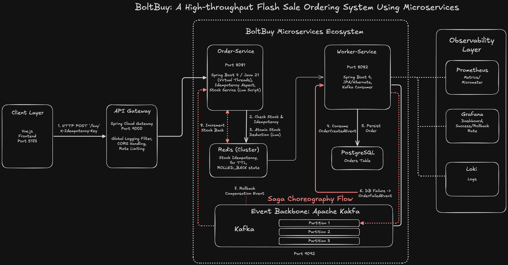
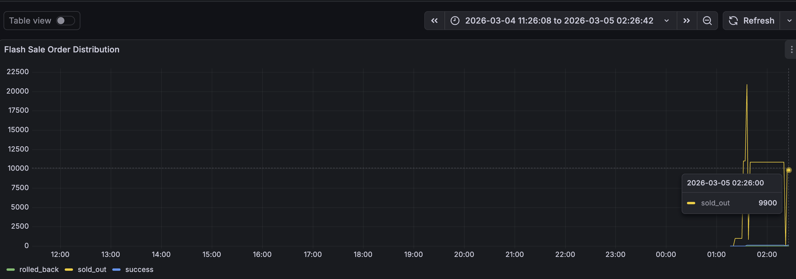
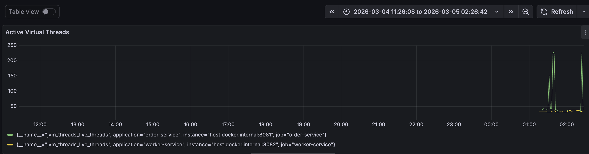
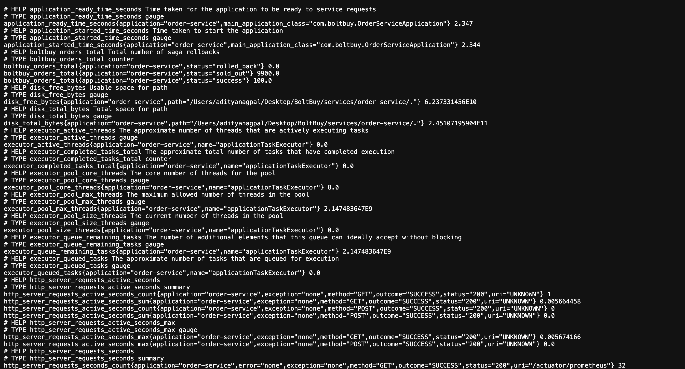

# BoltBuy ⚡ | Distributed Flash Sale Engine

**BoltBuy** is a production-grade microservices system designed for high-concurrency flash sale events. It utilizes **Java 21 Virtual Threads**, **Kafka**, and **Redis** to process thousands of orders per second with guaranteed data consistency.

---

## 🏗 System Architecture



### 🔄 The Order Flow:
1. **API Gateway (Port 9000):** Acts as the entry point, handling CORS and global logging.
2. **Order Service (Port 8081):** Validates requests via a Redis-backed Idempotency Aspect and performs atomic stock deduction using Lua Scripts.
3. **Kafka Backbone:** Decouples order acceptance from persistence, ensuring the system remains responsive during DB spikes.
4. **Worker Service (Port 8082):** Consumes events and persists orders to PostgreSQL.
5. **Saga Compensation:** If the Worker fails, a compensation event is fired to restore stock in Redis, ensuring zero "phantom inventory."

---

## 🚀 Key Features

* **Virtual Threads (Project Loom):** Handles 10k+ concurrent requests with 90% lower thread overhead compared to traditional thread-per-request models.
* **Atomic Stock Management:** Uses **Redis Lua Scripts** to prevent race conditions and overselling during millisecond-level traffic bursts.
* **Self-Healing Sagas:** Implements Choreography-based distributed transactions to maintain consistency across microservices.
* **Custom Idempotency Aspect:** Prevents duplicate orders from double-clicks or network retries with sub-50ms validation latency.
* **Full-Stack Observability:** Integrated with Prometheus, Grafana, and Loki for real-time tracking of Success vs. Rollback rates.

---

## 🛠 Tech Stack

| Category | Technology |
| :--- | :--- |
| **Backend** | Java 21, Spring Boot 4.0.2, Spring Cloud Gateway |
| **Messaging** | Apache Kafka |
| **Caching** | Redis (with Lua Scripting) |
| **Database** | PostgreSQL |
| **Monitoring** | Prometheus, Grafana, Loki, Micrometer |
| **Frontend** | Vue.js 3, Pinia, Tailwind CSS |

---

## 🏁 Getting Started

### Prerequisites
* Docker & Docker Compose
* Java 21
* Maven

### Run the Infrastructure
```bash
docker-compose up -d
```

## 📊 Performance & Reliability Proof of Concept

To validate the high-throughput architecture of **BoltBuy**, the system was subjected to a stress test of **10,000 concurrent requests** dispatched via a shell script. The following telemetry data was captured using **Prometheus** and **Grafana**.

### 1. High-Concurrency Traffic Spike


* **Atomic Inventory Limits:** The blue `success` line remains perfectly capped at **100 orders**, validating the **Redis Lua script**'s atomic "check-and-deduct" logic.
* **System Resilience:** The sharp yellow spike represents **9,900 concurrent `sold_out` responses**. Even at 10k requests, the system categorization remained accurate with zero overselling.

---

### 2. Java 21 Virtual Thread Performance


* **Lightweight Concurrency:** The graph shows the **Order Service** scaling to **200+ concurrent threads** instantly to handle the traffic burst.
* **Optimization:** By using **Java 21 Project Loom (Virtual Threads)**, the service maintained high responsiveness with a significantly lower memory footprint compared to traditional platform threads.

---

### 3. Distributed Transaction (Saga) Recovery


* **Self-Healing Logic:** This gauge tracks the successful execution of the **Choreography-based Saga pattern**.
* **Reliability:** The gauge shows **10 total saga recoveries**, where database-level failures were detected by the Worker Service, triggering an asynchronous compensation event to restore Redis inventory and update the idempotency state to `ROLLED_BACK`.

---

### 4. Real-time Business Telemetry (Prometheus)


* **Custom Actuator Metrics:** The raw Prometheus scrape endpoint shows real-time tracking of the `boltbuy_orders_total` counter.
* **Auditability:** Status tags (`success`, `sold_out`, `rolled_back`) allow for deep-dive auditing of every request lifecycle within the microservices ecosystem.
